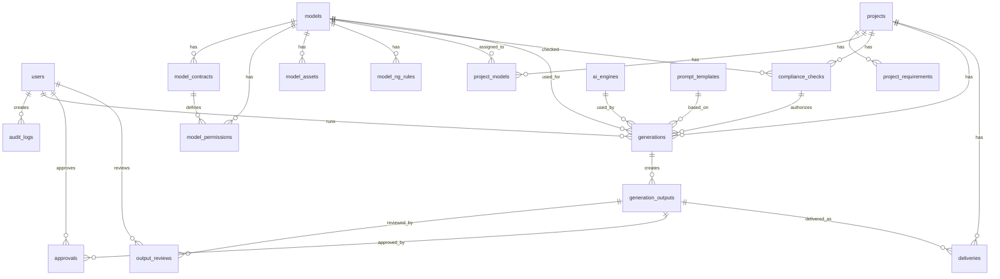

# Real AI Model Studio - Consolidated Development Package

---

# File: README.md

# Real AI Model Studio

社内専用・実在AIモデル生成基盤 開発引き継ぎパッケージ

## 目的

本人および所属事務所の明示的な許諾に基づき、実在モデルのAI肖像を広告・販促・商談用途で安全に生成・編集・管理するための社内専用システムを構築する。

本システムは単なる画像生成ソフトではなく、以下を統合した業務基盤である。

- モデル本人・事務所・契約・許諾管理
- 案件登録・利用条件管理
- 契約条件と案件条件のコンプライアンス照合
- 許諾範囲内でのAI画像生成
- 社内・法務・本人/事務所承認フロー
- 納品・利用期間・使用媒体管理
- 操作・生成・承認・納品・ダウンロードの監査ログ

## 最重要原則

- 対象は成人モデルのみ。
- 本人および所属事務所の書面同意を前提とする。
- 明示的性的表現、性行為表現、屈辱表現、未成年または未成年に見える人物の性的表現は対象外。
- 水着・下着・入浴表現は、本人・事務所の明示許諾と追加承認を前提に、広告・アパレル・リゾート・美容文脈に限定する。
- 生成前にコンプライアンス判定を通過しない限り、画像生成ジョブを実行できない設計とする。
- 生成後もレビュー・承認・納品管理・監査証跡を必須にする。

## 推奨開発スタック

- Frontend: Next.js / React / TypeScript
- Backend: Python FastAPI または Node.js/NestJS
- DB: PostgreSQL
- Storage: AWS S3 または Cloudflare R2
- Auth: Auth0 / Azure AD / Supabase Auth
- Queue: Celery / BullMQ
- AI Engine: 外部AI API + 将来自社GPU/自社モデル対応

## ファイル構成

```text
real_ai_model_studio_claude_code/
├── CLAUDE.md
├── README.md
├── docs/
│   ├── 00_project_overview.md
│   ├── 01_requirements.md
│   ├── 02_figma_wireframe_instructions.md
│   ├── 03_api_spec.md
│   ├── 04_db_er_design.md
│   ├── 05_compliance_rules.md
│   └── 06_non_functional_requirements.md
├── legal/
│   ├── 01_ai_likeness_contract_clauses.md
│   └── 02_operation_policy.md
├── proposal/
│   └── agency_proposal.md
├── planning/
│   ├── sprint_plan.md
│   ├── user_stories.md
│   └── mvp_backlog.md
└── src_reference/
    └── suggested_project_structure.md
```

## Claude Codeへの渡し方

1. このフォルダを新規リポジトリのルートに配置する。
2. `CLAUDE.md` を最初に読ませる。
3. まず `planning/mvp_backlog.md` の Phase 1 から実装を開始する。
4. 実装前に `docs/05_compliance_rules.md` を必ず参照させる。
5. 画像生成APIの実装は、外部AIエンジン差し替え可能なアダプタ方式にする。

## 注意

本資料は開発・事業設計用のたたき台であり、契約条項・肖像権・個人情報・広告表現・AI規制については、運用開始前に弁護士・専門家による確認を必須とする。

---

# File: CLAUDE.md

# CLAUDE.md

## Project: Real AI Model Studio

あなたは、このリポジトリにおいて「社内専用・実在AIモデル生成基盤」を開発するAI開発エージェントです。

このプロジェクトの目的は、本人および所属事務所の明示的な許諾に基づき、実在モデルのAI肖像を広告・販促・商談用途で安全に生成・編集・管理することです。

## 絶対に守るべき制約

1. 未成年または年齢不明モデルをAI生成対象にしない。
2. 明示的性的表現、性行為表現、屈辱的表現、犯罪・薬物・暴力・差別表現を生成対象にしない。
3. 水着・下着・入浴等の表現は、契約上の明示許諾と追加承認がある場合のみ扱う。
4. 生成ジョブは、必ずコンプライアンス判定を通過した案件に紐づける。
5. 生成・修正・承認・納品・ダウンロードの履歴をすべて監査ログに残す。
6. 元画像・参照画像・生成画像は、権限管理と暗号化保管を前提にする。
7. 外部AI APIは将来差し替えられるようにアダプタ方式で実装する。
8. 事業者側の都合で本人の許諾範囲を超えた生成ができないように、DB構造とAPI制御でブロックする。

## 実装優先順位

### Phase 1: Foundation

- 認証・ユーザー権限
- PostgreSQL DBスキーマ
- モデル管理
- 契約・許諾管理
- 監査ログ基盤

### Phase 2: Project & Compliance

- 案件管理
- 案件要件管理
- モデル紐づけ
- コンプライアンス判定API
- OK / Conditional / NG / Prohibited の判定ロジック

### Phase 3: Generation Studio

- AIエンジンアダプタ
- 生成ジョブ管理
- 生成結果保存
- 生成結果一覧
- 再生成・修正生成

### Phase 4: Review, Approval, Delivery

- 画像レビュー
- 承認フロー
- 納品管理
- ダウンロードログ
- 使用期間管理

### Phase 5: Hardening

- 権限テスト
- セキュリティテスト
- 監査ログ確認
- エラー処理
- 運用マニュアル

## 推奨ディレクトリ構造

`src_reference/suggested_project_structure.md` を参照してください。

## コード方針

- TypeScript / Python いずれも型を明確にする。
- APIレスポンスは一貫した形式にする。
- コンプライアンス判定ロジックは UI ではなく backend 側に置く。
- 監査ログは middleware/service 層で自動記録する。
- ファイル保存時には必ず file_hash を作成する。
- 削除は原則 soft delete。ただし法務判断による物理削除に対応できる設計にする。

## 最初に読むべき資料

1. `docs/00_project_overview.md`
2. `docs/01_requirements.md`
3. `docs/05_compliance_rules.md`
4. `docs/04_db_er_design.md`
5. `planning/mvp_backlog.md`

## 実装時の注意

このシステムでは「作れるか」よりも「作ってよいか」を優先してください。

UI上で生成ボタンを隠すだけでは不十分です。Backend/API/DB制約で生成不可を保証してください。

---

# File: docs/00_project_overview.md

# 00 Project Overview

## 1. プロジェクト名

Real AI Model Studio

## 2. 目的

実在する成人モデル本人および所属事務所の許諾に基づき、AI合成画像を広告・販促・営業提案用途で生成・管理する社内専用システムを構築する。

## 3. 背景

広告・EC・SNS・ブランドプロモーションでは、短納期・多バリエーション・特殊ロケーションのクリエイティブ需要が増えている。

一方、実在モデルの撮影には、スケジュール、渡航、ロケ費、天候、危険場所、再撮影などの制約がある。

本システムでは、本人が現実には対応しづらい宇宙・深海・海外・温泉・特殊背景などをAIで表現し、本人の出演機会と事務所の収益機会を拡張する。

## 4. システムの位置づけ

本システムは画像生成ツールではなく、以下の複合基盤である。

- 実在モデルのAI肖像管理システム
- 契約・許諾条件管理システム
- 案件別コンプライアンス判定システム
- AI画像生成・編集スタジオ
- レビュー・承認ワークフロー
- 納品・利用期間管理
- 監査証跡管理

## 5. 対象範囲

### 初期対象

- 成人モデルのみ
- 静止画生成
- 広告・販促・商談用素材
- 社内専用利用
- 国内案件中心

### 初期対象外

- 一般公開アプリ
- 未成年モデル
- 動画生成
- 明示的性的表現
- API外販
- 完全自動納品
- 外部事務所ログインポータル

## 6. 最重要設計思想

AIによる表現拡張と、本人の人格権・肖像権・名誉・ブランド価値保護を両立する。

「AIで何でも作れる」ではなく、「契約上・倫理上・事業上、作ってよいものだけを安全に作る」ことを価値にする。

---

# File: docs/01_requirements.md

# 01 Requirements

## 1. ユーザーロール

| Role | Main Permissions |
|---|---|
| Admin | 全機能、ユーザー管理、監査ログ閲覧、システム設定 |
| Legal | 契約・許諾管理、法務承認、リスク判定確認 |
| Sales | 案件登録、モデル候補選定、納品管理 |
| Creative | 画像生成、修正、候補選定、レビュー依頼 |
| Approver | 承認、差戻し、却下 |
| Viewer | 閲覧のみ |

## 2. 機能要件

### 2.1 認証・権限管理

- ログイン/ログアウト
- Role Based Access Control
- 二要素認証対応を推奨
- IP制限またはVPN制限を推奨

### 2.2 モデル管理

- モデル基本情報登録
- 成人確認フラグ
- 所属事務所情報
- 契約期間管理
- 契約書/同意書アップロード
- 許諾範囲登録
- NG条件登録
- 参照画像/学習画像/NG画像管理

### 2.3 案件管理

- 案件名
- クライアント名
- ブランド名
- 商品名
- 商品カテゴリ
- 利用媒体
- 利用地域
- 使用期間
- 出力種別
- 表現カテゴリ
- 露出レベル
- 参考画像
- クライアント要望

### 2.4 コンプライアンス判定

- 成人確認
- 契約有効性
- AI生成許可
- AI学習許可
- 媒体許可
- 地域許可
- 商品カテゴリ許可
- 露出レベル許可
- 水着/下着/入浴許可
- NGワード/NG構図
- 必要承認者判定

### 2.5 画像生成

- プロンプト入力
- 参照画像選択
- 生成テンプレート選択
- 画像比率指定
- 生成枚数指定
- 生成ジョブキュー
- 生成結果保存
- 再生成
- 部分修正
- 高解像度化

### 2.6 レビュー・承認

- 画像ごとのレビュー
- コメント
- 承認/条件付き承認/差戻し/却下
- 社内/法務/本人/事務所/管理者承認レベル
- 承認履歴保存

### 2.7 納品・利用管理

- 承認済み画像一覧
- 納品先登録
- 使用媒体登録
- 使用地域登録
- 使用期間登録
- ダウンロード履歴
- 利用終了処理
- 削除履歴

### 2.8 監査ログ

- ログイン履歴
- 閲覧履歴
- 作成/更新/削除履歴
- 契約変更履歴
- 生成履歴
- 承認履歴
- ダウンロード履歴

## 3. 画面一覧

1. Login
2. Dashboard
3. Model List
4. Model Detail
5. Contract & Permission
6. Asset Management
7. Project List
8. Project Detail
9. Compliance Check
10. Generation Studio
11. Generation Outputs
12. Image Compare & Revise
13. Review & Approval
14. Delivery Management
15. Audit Log
16. Admin Settings

## 4. MVP完了条件

- 成人確認なしのモデルでは生成できない。
- 契約期限切れモデルでは生成できない。
- 許諾外カテゴリでは生成できない。
- 水着/下着/入浴は追加承認が必要になる。
- 生成前にコンプライアンス判定が必須になる。
- 生成後にレビュー・承認・納品管理ができる。
- 監査ログで履歴を追跡できる。

---

# File: docs/02_figma_wireframe_instructions.md

# 02 Figma Wireframe Instructions

## 1. Design Concept

高級芸能事務所の管理画面、広告制作スタジオ、法務管理システムを統合したUIにする。

- 白、薄いグレー、濃紺、黒を基調
- OKはグリーン、注意はアンバー、NGはレッド
- 派手にしすぎず、上品で信頼感のある画面
- モデル画像は小さめに表示し、権限者のみ拡大可能
- 承認状態・契約期限・リスク状態が一目でわかるUI

## 2. Figma Pages

```text
00_Design System
01_Login
02_Dashboard
03_Model Management
04_Contract & Permission
05_Project Management
06_Compliance Check
07_Generation Studio
08_Review & Approval
09_Delivery Management
10_Audit Log
11_Admin Settings
```

## 3. Common Components

### Header

- Logo
- Current page title
- Notification icon
- User name
- Role badge
- Logout

### Sidebar

- Dashboard
- Models
- Projects
- Generation Studio
- Review
- Delivery
- Audit Log
- Settings

### Status Badges

| Badge | Meaning |
|---|---|
| Available | 利用可能 |
| Expiring Soon | 契約期限注意 |
| Suspended | 停止中 |
| Review Required | 承認必要 |
| Approved | 承認済 |
| Rejected | 却下 |
| Prohibited | 生成禁止 |

## 4. Dashboard

### KPI Cards

- Active Models
- Projects In Progress
- Pending Approvals
- High Risk Items
- Expiring Contracts

### Tables

- Pending approvals
- High risk projects
- Recent generations
- Contracts expiring within 30 days

## 5. Model List

### Layout

Left filter panel + right model card grid.

### Filters

- Agency
- Status
- Adult verified
- Swimwear allowed
- Underwear allowed
- Bath allowed
- Overseas allowed
- Video allowed
- Contract end date

### Model Card

- Profile image
- Stage name
- Agency
- Contract end
- Permission badges
- Status
- Detail button

## 6. Model Detail

Tabs:

- Overview
- Contract
- Permissions
- Assets
- NG Rules
- History

### Permissions Matrix

| Item | Allowed | Approval | Notes |
|---|---|---|---|
| AI generation | yes/no | internal/legal |  |
| AI training | yes/no | legal |  |
| Swimwear | yes/no/conditional | legal |  |
| Underwear | yes/no/conditional | person/agency |  |
| Bath | yes/no/conditional | person/agency |  |
| Body edit | yes/no/conditional | legal |  |
| Overseas | yes/no | agency |  |

## 7. Project Registration

Step UI:

1. Basic project info
2. Usage conditions
3. Expression conditions
4. Model selection
5. Compliance check

## 8. Compliance Check

Three-column layout:

- Left: project requirements
- Center: model permissions
- Right: judgement result

Judgement result:

- OK
- Conditional OK
- NG
- Prohibited

Show reasons clearly. Example:

```text
生成不可
理由：対象モデルの契約では海外SNS広告が許可されていません。
対応案：利用地域を日本国内に限定するか、事務所の追加承認を取得してください。
```

## 9. Generation Studio

Layout:

- Left: project/model/permission summary
- Center: output preview
- Right: generation settings
- Bottom: generation history

Generate button must be disabled when:

- Adult verification is false
- Contract expired
- AI generation is not allowed
- Compliance check is NG or Prohibited
- Required approval setting is missing

## 10. Review & Approval

Layout:

- Left: image preview
- Right: project conditions, permission conditions, judgement history
- Bottom: comments and approval buttons

Buttons:

- Approve
- Conditional approve
- Request revision
- Reject

## 11. Audit Log

Filters:

- User
- Model
- Project
- Action type
- Date range
- Risk level
- Download status

Log table:

- Date/time
- User
- Action
- Target
- Details
- IP address

---

# File: docs/03_api_spec.md

# 03 API Specification

## 1. Base

```text
/api/v1
```

## 2. Common Response

```json
{
  "success": true,
  "data": {},
  "error": null
}
```

## 3. Auth

### POST /auth/login

```json
{
  "email": "user@example.com",
  "password": "password",
  "otp_code": "123456"
}
```

### POST /auth/logout

Logout current session.

## 4. Users

### GET /users

Query:

```text
?role=legal&status=active
```

### POST /users

```json
{
  "name": "佐藤花子",
  "email": "sato@example.com",
  "role": "legal",
  "department": "Legal"
}
```

### PATCH /users/{user_id}

Update user.

## 5. Models

### GET /models

Query:

```text
?status=available&swimwear_allowed=true&agency_name=ABC
```

### POST /models

```json
{
  "stage_name": "Model A",
  "real_name": "山田花子",
  "agency_name": "ABC Agency",
  "birth_date": "1998-01-01",
  "adult_verified": true,
  "notes": "本人確認済み"
}
```

### GET /models/{model_id}

Get model detail.

### PATCH /models/{model_id}

Update model.

## 6. Contracts

### POST /models/{model_id}/contracts

```json
{
  "contract_number": "CON-2026-001",
  "contract_type": "base",
  "contract_start": "2026-07-01",
  "contract_end": "2027-06-30",
  "ai_generation_allowed": true,
  "ai_training_allowed": true,
  "synthetic_identity_allowed": true,
  "post_contract_use_allowed": false,
  "deletion_policy": "契約終了後30日以内に学習用データを停止・削除"
}
```

### POST /contracts/{contract_id}/files

FormData:

```text
file
file_type=contract|consent|agency_approval
```

## 7. Permissions

### POST /models/{model_id}/permissions

```json
{
  "contract_id": "uuid",
  "media_scope": ["web", "sns", "ec", "print"],
  "region_scope": ["japan", "asia"],
  "product_scope": ["beverage", "beauty", "apparel"],
  "prohibited_product_scope": ["finance", "medical", "political"],
  "swimwear_allowed": true,
  "underwear_allowed": false,
  "bath_allowed": "conditional",
  "exposure_level_max": 3,
  "face_edit_allowed": false,
  "body_edit_allowed": false,
  "hair_edit_allowed": true,
  "makeup_edit_allowed": true,
  "video_allowed": false,
  "secondary_use_allowed": false,
  "approval_required_level": "legal"
}
```

## 8. Assets

### POST /models/{model_id}/assets

FormData:

```text
file
asset_type=face|body|expression|pose|reference|ng
usage_type=training|reference|review_only|prohibited
tags=["front","smile"]
```

### GET /models/{model_id}/assets

Get model assets.

### DELETE /assets/{asset_id}

Soft delete or suspend asset.

## 9. Projects

### GET /projects

Get project list.

### POST /projects

```json
{
  "project_name": "宇宙背景 飲料広告",
  "client_name": "Client A",
  "brand_name": "Brand X",
  "product_name": "Premium Soda",
  "product_category": "beverage",
  "deadline": "2026-08-31"
}
```

### POST /projects/{project_id}/requirements

```json
{
  "media": ["web", "sns"],
  "region": ["japan"],
  "usage_start": "2026-09-01",
  "usage_end": "2026-12-31",
  "output_type": "image",
  "scene_type": "space",
  "outfit_type": "normal",
  "exposure_level": 0,
  "pose_description": "商品を持って正面を向く",
  "expression_description": "上品な笑顔",
  "background_description": "宇宙ステーションの窓辺"
}
```

### POST /projects/{project_id}/models

```json
{
  "model_id": "uuid",
  "usage_role": "main"
}
```

## 10. Compliance

### POST /projects/{project_id}/compliance-check

```json
{
  "model_id": "uuid"
}
```

Response:

```json
{
  "check_status": "conditional",
  "risk_level": "middle",
  "violations": [
    {
      "field": "bath_allowed",
      "message": "入浴表現は条件付き許可です。本人/事務所確認が必要です。"
    }
  ],
  "required_approvals": ["legal", "agency"],
  "check_summary": "生成は可能ですが、法務および事務所確認が必要です。"
}
```

## 11. Generations

### POST /generations

```json
{
  "project_id": "uuid",
  "model_id": "uuid",
  "compliance_check_id": "uuid",
  "ai_engine_id": "uuid",
  "prompt_text": "許諾範囲内の広告用画像を生成する。上品な宇宙背景で、商品を手に持つ。",
  "negative_prompt_text": "nudity, explicit, humiliating, illegal, minor-looking",
  "generation_params": {
    "aspect_ratio": "4:5",
    "width": 1024,
    "height": 1280,
    "output_count": 4,
    "style": "premium advertising"
  }
}
```

Response:

```json
{
  "generation_id": "uuid",
  "status": "queued"
}
```

### GET /generations/{generation_id}

Get generation status.

### GET /generations/{generation_id}/outputs

Get generation outputs.

## 12. Outputs

### PATCH /outputs/{output_id}/status

```json
{
  "output_status": "selected"
}
```

### POST /outputs/{output_id}/revise

```json
{
  "revision_prompt": "背景をより高級感のある照明に変更。人物の顔と体型は変更しない。",
  "target_area": "background"
}
```

## 13. Reviews

### POST /outputs/{output_id}/reviews

```json
{
  "review_type": "legal",
  "status": "revise",
  "comment": "利用媒体は問題ないが、衣装表現を少し控えめにしてください。"
}
```

## 14. Approvals

### POST /outputs/{output_id}/approvals

```json
{
  "approval_level": "legal",
  "approval_status": "approved",
  "approval_comment": "契約範囲内のため承認。"
}
```

## 15. Deliveries

### POST /deliveries

```json
{
  "project_id": "uuid",
  "output_id": "uuid",
  "delivered_to": "Client A",
  "delivery_method": "download_link",
  "usage_media": ["web", "sns"],
  "usage_region": ["japan"],
  "usage_start": "2026-09-01",
  "usage_end": "2026-12-31"
}
```

## 16. Audit Logs

### GET /audit-logs

Query:

```text
?target_type=output&action_type=download&from=2026-07-01&to=2026-07-31
```

---

# File: docs/04_db_er_design.md

# 04 Database & ER Design

## 1. Mermaid ER Diagram



## 2. Core Tables

### users

| Column | Type | Notes |
|---|---|---|
| id | uuid | PK |
| name | varchar |  |
| email | varchar | unique |
| role | varchar | admin/legal/sales/creative/approver/viewer |
| department | varchar |  |
| status | varchar | active/suspended |
| last_login_at | timestamp |  |
| created_at | timestamp |  |
| updated_at | timestamp |  |

### models

| Column | Type | Notes |
|---|---|---|
| id | uuid | PK |
| stage_name | varchar | 芸名 |
| real_name | varchar | 本名 |
| agency_name | varchar | 所属事務所 |
| agency_contact_name | varchar |  |
| agency_contact_email | varchar |  |
| birth_date | date |  |
| adult_verified | boolean | 成人確認 |
| adult_verified_at | timestamp |  |
| status | varchar | available/suspended/expired |
| profile_image_path | text |  |
| notes | text |  |
| created_at | timestamp |  |
| updated_at | timestamp |  |

### model_contracts

| Column | Type | Notes |
|---|---|---|
| id | uuid | PK |
| model_id | uuid | FK models.id |
| contract_number | varchar |  |
| contract_type | varchar | base/individual/additional_consent |
| contract_start | date |  |
| contract_end | date |  |
| renewal_type | varchar | auto/negotiation/end |
| contract_file_path | text |  |
| consent_file_path | text |  |
| agency_approval_file_path | text |  |
| ai_generation_allowed | boolean |  |
| ai_training_allowed | boolean |  |
| synthetic_identity_allowed | boolean |  |
| post_contract_use_allowed | boolean |  |
| deletion_policy | text |  |
| created_by | uuid | FK users.id |
| created_at | timestamp |  |

### model_permissions

| Column | Type | Notes |
|---|---|---|
| id | uuid | PK |
| model_id | uuid | FK models.id |
| contract_id | uuid | FK model_contracts.id |
| media_scope | jsonb | web/sns/ec/print/outdoor/video |
| region_scope | jsonb | japan/asia/eu/global |
| product_scope | jsonb | allowed categories |
| prohibited_product_scope | jsonb | prohibited categories |
| swimwear_allowed | boolean |  |
| underwear_allowed | boolean |  |
| bath_allowed | varchar | yes/no/conditional |
| exposure_level_max | integer | 0-4 |
| face_edit_allowed | boolean |  |
| body_edit_allowed | boolean |  |
| hair_edit_allowed | boolean |  |
| makeup_edit_allowed | boolean |  |
| age_appearance_change_allowed | boolean |  |
| video_allowed | boolean |  |
| secondary_use_allowed | boolean |  |
| approval_required_level | varchar | internal/legal/agency/person |
| notes | text |  |
| created_at | timestamp |  |

### model_assets

| Column | Type | Notes |
|---|---|---|
| id | uuid | PK |
| model_id | uuid | FK models.id |
| asset_type | varchar | face/body/expression/pose/ng/reference |
| file_path | text |  |
| original_filename | varchar |  |
| file_hash | varchar |  |
| usage_type | varchar | training/reference/review_only/prohibited |
| consent_confirmed | boolean |  |
| photographer_right_confirmed | boolean |  |
| quality_score | integer |  |
| tags | jsonb |  |
| is_encrypted | boolean |  |
| uploaded_by | uuid | FK users.id |
| created_at | timestamp |  |

### projects

| Column | Type | Notes |
|---|---|---|
| id | uuid | PK |
| project_name | varchar |  |
| client_name | varchar |  |
| brand_name | varchar |  |
| product_name | varchar |  |
| product_category | varchar |  |
| owner_user_id | uuid | FK users.id |
| project_status | varchar | draft/generating/review/approved/delivered/closed |
| risk_level | varchar | low/middle/high/prohibited |
| deadline | date |  |
| created_at | timestamp |  |
| updated_at | timestamp |  |

### project_requirements

| Column | Type | Notes |
|---|---|---|
| id | uuid | PK |
| project_id | uuid | FK projects.id |
| media | jsonb |  |
| region | jsonb |  |
| usage_start | date |  |
| usage_end | date |  |
| output_type | varchar | image/video |
| scene_type | varchar | studio/resort/space/deepsea/bath/etc |
| outfit_type | varchar | normal/swimwear/underwear/etc |
| exposure_level | integer | 0-5 |
| pose_description | text |  |
| expression_description | text |  |
| background_description | text |  |
| reference_files | jsonb |  |
| client_notes | text |  |
| legal_notes | text |  |

### compliance_checks

| Column | Type | Notes |
|---|---|---|
| id | uuid | PK |
| project_id | uuid | FK projects.id |
| model_id | uuid | FK models.id |
| check_status | varchar | ok/conditional/ng/prohibited |
| risk_level | varchar | low/middle/high/prohibited |
| matched_permissions | jsonb |  |
| violations | jsonb |  |
| required_approvals | jsonb |  |
| check_summary | text |  |
| checked_by | uuid | FK users.id |
| checked_at | timestamp |  |

### generations

| Column | Type | Notes |
|---|---|---|
| id | uuid | PK |
| project_id | uuid | FK projects.id |
| model_id | uuid | FK models.id |
| compliance_check_id | uuid | FK compliance_checks.id |
| ai_engine_id | uuid | FK ai_engines.id |
| prompt_text | text |  |
| negative_prompt_text | text |  |
| prompt_template_id | uuid | FK prompt_templates.id |
| generation_params | jsonb |  |
| output_count | integer |  |
| status | varchar | queued/running/completed/failed |
| generated_by | uuid | FK users.id |
| generated_at | timestamp |  |

### generation_outputs

| Column | Type | Notes |
|---|---|---|
| id | uuid | PK |
| generation_id | uuid | FK generations.id |
| file_path | text |  |
| file_hash | varchar |  |
| thumbnail_path | text |  |
| width | integer |  |
| height | integer |  |
| output_status | varchar | candidate/selected/rejected/approved/delivered |
| visual_risk_score | integer |  |
| face_consistency_score | integer |  |
| quality_score | integer |  |
| watermark_applied | boolean |  |
| c2pa_metadata_applied | boolean |  |
| created_at | timestamp |  |

### approvals

| Column | Type | Notes |
|---|---|---|
| id | uuid | PK |
| output_id | uuid | FK generation_outputs.id |
| approver_id | uuid | FK users.id |
| approval_level | varchar | internal/legal/agency/person/admin |
| approval_status | varchar | approved/rejected/revoked |
| approval_comment | text |  |
| approved_at | timestamp |  |

### audit_logs

| Column | Type | Notes |
|---|---|---|
| id | uuid | PK |
| user_id | uuid | FK users.id |
| action_type | varchar | login/create/update/delete/generate/download/approve |
| target_type | varchar | model/project/output/contract |
| target_id | uuid |  |
| before_data | jsonb |  |
| after_data | jsonb |  |
| ip_address | varchar |  |
| user_agent | text |  |
| created_at | timestamp |  |

## 3. Critical DB Rules

1. `generations.compliance_check_id` is required.
2. Compliance check status must be `ok` or `conditional` before generation can run.
3. If status is `conditional`, required approvals must be configured before final delivery.
4. Contract and permission records must never be hard-deleted in ordinary operation.
5. Asset deletion should be soft-delete by default, with legal physical-delete procedure available.
6. Every create/update/delete/generate/download/approve action must write `audit_logs`.

---

# File: docs/05_compliance_rules.md

# 05 Compliance Rules

## 1. Judgement Status

| Status | Meaning | Handling |
|---|---|---|
| OK | 生成可能 | 通常フロー |
| Conditional | 条件付き可能 | 追加承認後に利用可 |
| NG | 生成不可 | 生成ボタン無効 |
| Prohibited | 絶対禁止 | 管理者でも解除不可 |

## 2. Base Rules

| No | Item | Condition | Result |
|---:|---|---|---|
| 1 | 成人確認 | adult_verified=false | Prohibited |
| 2 | 年齢不明 | birth_date is null or adult verification missing | NG |
| 3 | 契約有効性 | contract_end < today | NG |
| 4 | AI生成許可 | ai_generation_allowed=false | NG |
| 5 | AI学習許可 | training requested and ai_training_allowed=false | NG |
| 6 | 利用媒体 | project.media not in permission.media_scope | NG |
| 7 | 利用地域 | project.region not in permission.region_scope | NG |
| 8 | 商品カテゴリ | project.category in prohibited_product_scope | NG |
| 9 | 商品カテゴリ | project.category not in product_scope | Conditional or NG |
| 10 | 使用期間 | usage_end > contract_end | Conditional |
| 11 | 二次利用 | secondary_use=true and not allowed | NG |
| 12 | 海外配信 | overseas=true and not allowed | NG |
| 13 | 動画利用 | output_type=video and not allowed | NG |

## 3. Expression Rules

| Expression | Condition | Result |
|---|---|---|
| 通常広告 | exposure_level 0-1 | OK |
| リゾート | exposure_level 1-2 | OK or Conditional |
| スポーツ | exposure_level 1-2 | OK |
| 水着 | swimwear_allowed=false | NG |
| 水着 | swimwear_allowed=true | Conditional |
| 下着 | underwear_allowed=false | NG |
| 下着 | underwear_allowed=true | Conditional |
| 入浴 | bath_allowed=false | NG |
| 入浴 | bath_allowed=conditional | Conditional |
| 明示的ヌード | any | Prohibited |
| 性行為示唆 | any | Prohibited |
| 屈辱的表現 | any | Prohibited |
| 犯罪・薬物・暴力・差別 | any | Prohibited |

## 4. Exposure Levels

| Level | Definition | Default Result |
|---:|---|---|
| 0 | 通常衣装 | OK |
| 1 | ノースリーブ、脚出し等 | OK |
| 2 | スポーツ、リゾート軽露出 | OK/Conditional |
| 3 | 水着 | Conditional |
| 4 | 下着、入浴、ボディライン強調 | Conditional |
| 5 | 明示的性的表現 | Prohibited |

## 5. Age and Appearance Rules

| Rule | Condition | Result |
|---|---|---|
| 実年齢18歳未満 | true | Prohibited |
| 成人確認なし | true | NG or Prohibited |
| 未成年に見える演出 | true | Prohibited |
| 制服風 × 露出表現 | true | Prohibited |
| 幼く見せる加工 | true | Prohibited |
| 年齢を若く見せる指示 | age_appearance_change_allowed=false | NG |

## 6. Product Category Rules

| Category | Default Result |
|---|---|
| 飲料 | OK |
| 食品 | OK |
| 美容 | OK/Conditional |
| アパレル | OK |
| 水着 | Conditional |
| 下着 | Conditional |
| 旅行 | OK |
| 温泉旅館 | Conditional |
| 健康食品 | Conditional |
| 医療 | Conditional/NG |
| 金融 | Conditional/NG |
| 政治 | NG |
| 宗教 | NG |
| 成人向け | Prohibited |
| ギャンブル | NG |
| 違法商材 | Prohibited |

## 7. Prompt Blocking Terms

Block prompts containing terms or instructions related to:

- minors or minor-like sexualization
- explicit nudity
- sexual acts
- humiliation
- coercion
- restraint in sexualized context
- crime
- illegal drugs
- violence
- discrimination
- political endorsement
- religious endorsement
- medical efficacy claims
- false personal recommendation

## 8. Warning Terms

Terms that require warning and possible legal review:

- セクシー
- 濡れ感
- ベッド
- 密着
- 透け感
- 大胆
- 挑発的
- 悩殺

These are not automatically prohibited, but must be evaluated by context, contract and permission settings.

## 9. Approval Requirements

| Condition | Required Approval |
|---|---|
| 通常広告 | Creative lead |
| 初回利用モデル | Creative + Legal |
| 水着 | Legal |
| 下着 | Legal + Person/Agency |
| 入浴 | Legal + Person/Agency |
| 海外配信 | Legal + Agency |
| 医療/健康食品 | Legal |
| 金融 | Legal + Admin |
| 屋外広告 | Legal + Agency |
| 大型広告 | Admin |

## 10. Post-generation Checks

Every selected output must be checked for:

- face consistency
- body modification beyond permission
- outfit compliance
- exposure level
- background risk
- hand/finger errors
- text/logo errors
- false endorsement
- product claim risk
- dignity/brand image risk

---

# File: docs/06_non_functional_requirements.md

# 06 Non Functional Requirements

## 1. Security

- HTTPS only
- Role Based Access Control
- Optional IP restriction / VPN restriction
- 2FA recommended
- Encrypted storage for original and reference images
- File hash for all uploaded and generated files
- Download permission control
- Download audit log
- No public access to raw image files

## 2. Privacy & Data Protection

- Store only necessary personal data
- Separate identity data and generated assets where possible
- Log all access to model personal data
- Support data usage suspension
- Support legally approved physical deletion workflow

## 3. Auditability

- All critical actions must create audit logs
- Logs should include user, timestamp, target, action, IP, user agent, before/after data when applicable
- Contract and permission changes must be traceable
- Generation must store prompt, engine, parameters, compliance check ID and output IDs

## 4. Availability

- Initial target: internal business-hour availability
- Daily backup
- Disaster recovery procedure
- Storage lifecycle management

## 5. Performance

- Standard screen response target: under 3 seconds
- Generation time depends on AI engine
- Initial concurrent users: 10-30
- Heavy generation handled by queue worker

## 6. Maintainability

- AI engine adapter pattern
- Rule engine separated from UI
- Prompt templates managed in DB
- Prohibited terms managed in DB
- Permission logic testable by unit tests

## 7. Extensibility

Future support:

- Video generation
- Agency approval portal
- Person approval portal
- C2PA/Content Credentials
- Invisible watermark
- self-hosted GPU
- multilingual UI
- brand template library

---

# File: legal/01_ai_likeness_contract_clauses.md

# 01 AI肖像利用 契約条項案

> 注意：本資料は契約書作成のたたき台です。実運用前に弁護士確認を必須としてください。

## 第1条 AI肖像の定義

本契約において「AI肖像」とは、本人の写真、映像、音声、身体的特徴、表情、ポーズ、その他本人を識別し得る情報を参照し、AIその他の画像生成・編集技術を用いて作成する、本人に類似する静止画、動画、その他のデジタルコンテンツをいう。

## 第2条 AI肖像利用の許諾

本人および所属事務所は、別紙に定める範囲に限り、甲が本人のAI肖像を広告、販促、営業提案、商品紹介、その他事前に合意した目的で生成、編集、保存、使用することを許諾する。

## 第3条 利用目的

AI肖像の利用目的は、以下に限定する。

1. 広告・販促素材の制作
2. 商品・サービスの紹介
3. クライアントへの提案資料作成
4. EC、SNS、Web、紙媒体その他合意済み媒体での使用
5. その他、本人および所属事務所が事前に書面で承諾した目的

## 第4条 利用範囲

AI肖像の利用媒体、利用地域、利用期間、商品カテゴリ、表現カテゴリ、二次利用の可否は、別紙許諾条件表に定めるものとする。甲は、当該範囲を超えてAI肖像を利用してはならない。

## 第5条 禁止表現

甲は、本人のAI肖像について、以下の表現を生成または使用してはならない。

1. 本人の名誉、信用、品位または人格を毀損する表現
2. 明示的な性的表現、性行為を示唆する表現
3. 本人が未成年である、または未成年に見える状態での性的表現
4. 暴力、拘束、犯罪、薬物、差別、反社会的行為に関連する表現
5. 本人が特定の政治、宗教、思想、医療、金融商品等を支持・推奨していると誤認させる表現
6. 本人または所属事務所が別途指定するNG表現
7. その他、社会通念上本人の評価を低下させるおそれのある表現

## 第6条 水着・下着・入浴等の表現

水着、下着、入浴、肌露出を伴う表現については、別紙において明示的に許諾された場合に限り生成および使用できるものとする。

当該表現を使用する場合、甲は事前に生成案または完成画像を本人または所属事務所に提示し、書面または電子的記録により承認を得るものとする。

## 第7条 AI学習利用

本人の写真、映像その他の素材をAIモデルの学習、追加学習、特徴抽出、参照データ作成に利用する場合、甲は本人および所属事務所から事前に明示的な同意を得るものとする。

学習利用の可否、利用する素材、保存期間、削除条件は別紙に定める。

## 第8条 データ管理

甲は、本人の元画像、参照画像、生成画像、学習用データを、適切なアクセス制限、暗号化、監査ログ管理のもとで保管するものとする。

甲は、当該データを本契約に定める目的以外で使用してはならず、第三者に無断提供してはならない。

## 第9条 承認手続

甲は、AI肖像を商用利用する前に、表現内容、媒体、地域、期間、商品カテゴリが許諾範囲内であることを確認する。

別紙に定める高リスク表現については、本人または所属事務所の事前承認を必須とする。

## 第10条 修正、停止、削除

本人または所属事務所は、AI肖像が許諾範囲を逸脱している、または本人の名誉・信用・人格を損なうおそれがあると合理的に判断した場合、甲に対し、修正、使用停止、削除を請求できる。

甲は、当該請求を受けた場合、速やかに確認を行い、必要な措置を講じるものとする。

## 第11条 契約終了後の取扱い

契約終了後、甲は本人のAI肖像を新たに生成してはならない。

既に承認済みの広告素材については、別紙に定める使用期間内に限り使用できるものとする。ただし、本人または所属事務所から合理的な理由に基づく停止要請があった場合、甲乙協議の上、対応を決定する。

## 第12条 生成履歴および監査証跡

甲は、AI肖像の生成、編集、承認、納品、使用、削除に関する履歴を記録し、必要に応じて本人または所属事務所に開示できる体制を整備する。

## 第13条 第三者提供および再許諾の禁止

甲は、本人および所属事務所の事前承諾なく、AI肖像、元画像、学習データ、生成モデルを第三者に提供、譲渡、貸与、再許諾してはならない。

---

# File: legal/02_operation_policy.md

# 02 Operation Policy

## 1. 基本運用方針

Real AI Model Studioは、本人許諾済みAI肖像を広告制作に活用する社内専用システムである。

すべての運用は、本人の人格権・肖像権・名誉・ブランド価値の保護を優先する。

## 2. 生成前チェック

生成前に必ず確認する。

- 成人確認済みか
- 契約期間内か
- AI生成が許可されているか
- AI学習が必要な場合、学習利用が許可されているか
- 案件媒体が許可範囲内か
- 利用地域が許可範囲内か
- 商品カテゴリが許可範囲内か
- 表現カテゴリが許可範囲内か
- 露出レベルが上限内か
- NG条件に該当しないか

## 3. 高リスク表現

以下は必ず法務確認を必要とする。

- 水着
- 下着
- 入浴
- ボディライン強調
- 濡れ感演出
- 海外配信
- 健康食品・医療・金融
- 屋外広告
- 大型広告

下着・入浴等は、本人または事務所の追加確認を原則必須とする。

## 4. 禁止表現

- 明示的ヌード
- 性行為表現
- 未成年または未成年に見える人物の性的表現
- 屈辱・侮辱表現
- 犯罪・薬物・暴力・差別表現
- 政治・宗教・医療・金融の誤認推薦
- 本人が実際に発言していない推薦・証言

## 5. データ管理

- 元画像は権限者のみ閲覧可能
- ダウンロードは原則制限
- ダウンロードした場合はログを残す
- 外部共有は管理者承認を必要とする
- 契約終了後の取り扱いは契約に従う

## 6. 事故発生時

以下の場合、直ちに利用停止する。

- 許諾範囲外の生成・利用が判明した場合
- 本人または事務所から停止要請があった場合
- 広告主利用が契約条件と異なる場合
- 生成画像が本人の名誉・信用を損なう可能性がある場合

対応手順：

1. 対象画像の利用停止
2. ダウンロード/納品先確認
3. 監査ログ確認
4. 本人/事務所/広告主への連絡方針決定
5. 修正・削除・再発防止策実施

---

# File: proposal/agency_proposal.md

# 芸能事務所向け提案資料

## タイトル

本人の価値を守りながら、出演機会を拡張する Real AI Model Studio

## サブコピー

撮影できない場所へ。本人が行けない時間へ。ブランドの世界観へ。

AIは、本人の代替ではなく、本人の可能性を広げる制作基盤です。

## 1. 提案背景

広告・EC・SNS領域では、短納期・多バリエーション・低コストでのクリエイティブ制作需要が高まっている。

一方、実在モデルの撮影には、スケジュール、ロケ費、渡航費、危険場所、天候、再撮影などの制約がある。

Real AI Model Studioは、本人および事務所の許諾範囲内でAI肖像を生成し、モデル本人の出演機会と事務所の収益機会を拡張する。

## 2. できること

| Scene | Use Case |
|---|---|
| 宇宙 | 未来感、先進ブランド、SF広告 |
| 深海 | 神秘性、高級感、幻想性 |
| 海外 | 渡航なしで海外風広告 |
| 温泉 | 旅館、地域PR、リゾート |
| 雪山 | 季節広告、アウトドア |
| 高級ホテル | ラグジュアリーブランド |
| スタジオ | EC、商品撮影、SNS |

## 3. 事務所側メリット

| Merit | Detail |
|---|---|
| 新収益源 | 本人が現場に行けない案件も受注可能 |
| 拘束時間削減 | 撮影負担を軽減 |
| 安全性 | 危険なロケを回避 |
| 表現拡張 | 現実では難しい世界観を制作 |
| 契約管理 | 使用範囲を明確化 |
| ブランド保護 | NG表現をシステムで制御 |
| 監査可能 | 生成・承認・納品履歴を保存 |

## 4. 本人保護の仕組み

- 本人・事務所の書面同意
- 利用媒体の制限
- 利用地域の制限
- 利用期間の制限
- 商品カテゴリの制限
- 水着・下着・入浴表現の個別承認
- NG表現登録
- 契約終了後の新規生成停止
- 生成履歴の監査
- 使用停止・削除請求への対応

## 5. 許諾管理例

| Item | Detail |
|---|---|
| 利用媒体 | Web、SNS、EC、紙媒体 |
| 利用地域 | 日本、アジア、全世界 |
| 利用期間 | 3ヶ月、6ヶ月、1年 |
| 商品カテゴリ | 飲料、美容、アパレル等 |
| 表現カテゴリ | 通常、リゾート、水着等 |
| 露出レベル | 0〜4で管理 |
| 承認条件 | 社内、法務、本人、事務所 |

## 6. 承認フロー

### 通常広告

```text
案件登録
↓
契約条件チェック
↓
AI生成
↓
社内確認
↓
納品
```

### 高リスク表現

```text
案件登録
↓
契約条件チェック
↓
AI生成
↓
法務確認
↓
本人/事務所確認
↓
承認後納品
```

## 7. 当社が行わないこと

- 許諾外の生成
- 無断学習
- 無断第三者提供
- 無断二次利用
- 契約外媒体での使用
- 契約外地域での使用
- 本人のイメージを毀損する表現
- 明示的性的表現
- 未成年または未成年に見える性的表現

## 8. 提案メッセージ

AIは、本人の仕事を奪うものではありません。

本人が行けない場所へ行き、本人が受けられなかった案件を受け、本人の価値をより安全に、より広く届けるための制作基盤です。

本提案は、モデル本人の肖像権・人格権・ブランド価値を守りながら、事務所に新しい収益機会を生み出す取り組みです。

---

# File: planning/sprint_plan.md

# Sprint Plan

## MVP Goal

12週間で社内利用可能な静止画生成MVPを構築する。

## Parallel Tracks

### Track A: UI/UX

| Week | Work |
|---|---|
| 1 | Figma wireframe |
| 2 | UI design |
| 3 | Prototype |
| 4-12 | Implementation review |

### Track B: Backend/DB

| Week | Work |
|---|---|
| 1 | DB design |
| 2 | Auth/RBAC |
| 3 | Model API |
| 4 | Contract/Permission API |
| 5 | Project API |
| 6 | Compliance API |
| 7 | Generation job API |
| 8 | Review/Approval API |
| 9 | Audit log |
| 10 | Delivery management |
| 11-12 | Testing/fixes |

### Track C: Frontend

| Week | Work |
|---|---|
| 1 | Next.js setup |
| 2 | Login/layout |
| 3 | Dashboard |
| 4 | Model management |
| 5 | Contract/permission UI |
| 6 | Project management |
| 7 | Compliance check UI |
| 8 | Generation studio |
| 9 | Review/approval |
| 10 | Delivery/audit UI |
| 11-12 | UI polish |

### Track D: AI Integration

| Week | Work |
|---|---|
| 1 | AI engine selection |
| 2 | Generation API testing |
| 3 | Reference image testing |
| 4 | Prompt templates |
| 5 | Generation job management |
| 6 | Image storage |
| 7 | Regeneration/revision |
| 8 | Upscaling |
| 9 | Quality validation |
| 10-12 | Improvements |

### Track E: Compliance/Legal

| Week | Work |
|---|---|
| 1 | Permission item definition |
| 2 | Contract clause review |
| 3 | Prohibited category definition |
| 4 | Exposure level definition |
| 5 | Rule implementation review |
| 6 | Approval flow review |
| 7 | Agency proposal review |
| 8-12 | Test project review |

### Track F: QA/Security

| Week | Work |
|---|---|
| 1 | Security requirements |
| 2 | Role test design |
| 3 | Storage encryption design |
| 4 | Audit log design |
| 5 | Test cases |
| 6 | Permission tests |
| 7 | Generation tests |
| 8 | Approval tests |
| 9 | Audit tests |
| 10 | Security tests |
| 11 | UAT |
| 12 | Launch preparation |

## Week-by-week Plan

### Week 1

- Kickoff
- Finalize requirements
- Confirm roles
- Confirm AI engine candidates
- Confirm legal risks

### Week 2

- Figma first draft
- DB first draft
- API first draft
- Auth foundation
- Storage design

### Week 3

- Model CRUD
- Model list/detail UI
- Adult verification flag
- Basic audit logging

### Week 4

- Contract registration
- Consent file upload
- Permission registration
- NG rules
- Encrypted asset storage

### Week 5

- Project registration
- Project requirements
- Model assignment
- Project list/detail UI

### Week 6

- Compliance rule engine
- OK/Conditional/NG/Prohibited
- Required approval detection
- Prohibited term dictionary

### Week 7

- AI engine adapter
- Generation job queue
- Output storage
- Generation status

### Week 8

- Generation studio UI
- Prompt template
- Reference image selection
- Regeneration

### Week 9

- Review UI
- Approval API
- Comments
- Conditional approval

### Week 10

- Delivery management
- Download logs
- Audit log screen
- CSV export

### Week 11

- Integration test
- RBAC test
- Compliance test
- Security review

### Week 12

- UAT
- Production setup
- Initial data registration
- Manuals
- Launch decision

---

# File: planning/user_stories.md

# User Stories

## Admin

- As an Admin, I want to create and suspend users so that access is controlled.
- As an Admin, I want to view all audit logs so that I can investigate incidents.
- As an Admin, I want to manage AI engines so that the system can switch providers.

## Legal

- As Legal, I want to register model contracts so that generation is limited to valid agreements.
- As Legal, I want to define permission scopes so that the system can block unauthorized generation.
- As Legal, I want to approve high-risk outputs so that risky materials do not leave the company unchecked.
- As Legal, I want to see contract change history so that permission changes are traceable.

## Sales

- As Sales, I want to register client projects so that generation work is tied to a real business purpose.
- As Sales, I want to select candidate models based on permission scopes so that I can propose safe options.
- As Sales, I want to track delivery and usage periods so that usage does not exceed the contract.

## Creative

- As Creative, I want to generate images from approved projects so that I can create ad materials.
- As Creative, I want to select reference images so that outputs resemble the approved model.
- As Creative, I want to revise outputs while preserving face and body permissions so that revisions remain compliant.
- As Creative, I want to compare outputs so that I can choose the best candidate.

## Approver

- As an Approver, I want to review image outputs with project and permission details side by side so that I can make informed decisions.
- As an Approver, I want to approve, reject or request revision so that the workflow is controlled.

## Viewer

- As a Viewer, I want to see approved project outputs so that I can check final deliverables without editing them.

---

# File: planning/mvp_backlog.md

# MVP Backlog

## P0: Must Have

| ID | Task | Owner | Acceptance Criteria |
|---|---|---|---|
| P0-001 | Auth & login | Backend/Frontend | User can login and logout |
| P0-002 | RBAC | Backend | Role controls access to APIs |
| P0-003 | User management | Admin | Admin can create/suspend users |
| P0-004 | Model CRUD | Backend/Frontend | Model can be registered and viewed |
| P0-005 | Adult verification | Legal/Admin | Model without adult verification cannot generate |
| P0-006 | Contract registration | Legal | Contract period and AI permissions are stored |
| P0-007 | Consent file upload | Backend | Contract/consent PDFs can be stored securely |
| P0-008 | Permission scope | Legal | Media/region/product/exposure permissions are stored |
| P0-009 | Asset upload | Creative/Legal | Reference images can be uploaded with usage type |
| P0-010 | Project CRUD | Sales | Projects can be created and viewed |
| P0-011 | Project requirements | Sales | Usage and expression conditions are stored |
| P0-012 | Model assignment | Sales | Models can be assigned to projects |
| P0-013 | Compliance check | Backend | OK/Conditional/NG/Prohibited is returned |
| P0-014 | Generate lock | Backend | Generation cannot run without valid compliance check |
| P0-015 | AI adapter | AI | Generation engine is behind an adapter interface |
| P0-016 | Generation job | Backend | Jobs can be queued and status checked |
| P0-017 | Output storage | Backend | Generated images are stored with hash |
| P0-018 | Output list | Frontend | Outputs are visible by project |
| P0-019 | Review | Frontend/Backend | Review comment and status can be saved |
| P0-020 | Approval | Frontend/Backend | Approval levels can approve/reject |
| P0-021 | Delivery | Sales | Approved outputs can be delivered/registered |
| P0-022 | Audit log | Backend | Critical actions are logged |

## P1: Should Have

| ID | Task | Acceptance Criteria |
|---|---|---|
| P1-001 | Prohibited terms dictionary | Prompt warning/block works |
| P1-002 | Download restrictions | Only allowed roles can download |
| P1-003 | CSV audit export | Admin can export logs |
| P1-004 | Prompt templates | Templates can be selected |
| P1-005 | Output compare UI | Two/four outputs can be compared |
| P1-006 | Revision generation | Selected output can be revised |
| P1-007 | Contract expiry alerts | Dashboard shows contracts expiring soon |

## P2: Later

| ID | Task |
|---|---|
| P2-001 | Agency approval portal |
| P2-002 | Person approval portal |
| P2-003 | C2PA metadata |
| P2-004 | Invisible watermark |
| P2-005 | Self-hosted GPU |
| P2-006 | Video generation |
| P2-007 | Multilingual UI |
| P2-008 | Face consistency scoring |

---

# File: src_reference/suggested_project_structure.md

# Suggested Project Structure

## Monorepo Example

```text
real-ai-model-studio/
├── CLAUDE.md
├── README.md
├── apps/
│   ├── web/
│   │   ├── src/
│   │   │   ├── app/
│   │   │   ├── components/
│   │   │   ├── features/
│   │   │   │   ├── auth/
│   │   │   │   ├── dashboard/
│   │   │   │   ├── models/
│   │   │   │   ├── projects/
│   │   │   │   ├── compliance/
│   │   │   │   ├── generation/
│   │   │   │   ├── review/
│   │   │   │   ├── delivery/
│   │   │   │   └── audit/
│   │   │   ├── lib/
│   │   │   └── types/
│   │   └── package.json
│   └── api/
│       ├── app/
│       │   ├── main.py
│       │   ├── core/
│       │   ├── db/
│       │   ├── models/
│       │   ├── schemas/
│       │   ├── routers/
│       │   │   ├── auth.py
│       │   │   ├── users.py
│       │   │   ├── models.py
│       │   │   ├── contracts.py
│       │   │   ├── projects.py
│       │   │   ├── compliance.py
│       │   │   ├── generations.py
│       │   │   ├── reviews.py
│       │   │   ├── approvals.py
│       │   │   ├── deliveries.py
│       │   │   └── audit.py
│       │   ├── services/
│       │   │   ├── compliance_engine.py
│       │   │   ├── audit_service.py
│       │   │   ├── storage_service.py
│       │   │   ├── generation_service.py
│       │   │   └── ai_engines/
│       │   │       ├── base.py
│       │   │       ├── openai_adapter.py
│       │   │       ├── replicate_adapter.py
│       │   │       └── self_hosted_adapter.py
│       │   └── workers/
│       │       └── generation_worker.py
│       └── pyproject.toml
├── packages/
│   └── shared-types/
├── docs/
├── legal/
├── planning/
└── proposal/
```

## Backend Service Rules

- `compliance_engine.py` contains all generation permission logic.
- `generation_service.py` must call compliance check before creating generation jobs.
- `audit_service.py` must log all critical operations.
- `storage_service.py` must calculate file hash for uploads and outputs.
- AI engines must implement a common interface.

## AI Engine Interface Example

```python
from abc import ABC, abstractmethod
from typing import Any, Dict, List

class AIEngineAdapter(ABC):
    @abstractmethod
    async def generate_image(self, prompt: str, params: Dict[str, Any]) -> List[str]:
        """Return list of generated image file paths or temporary URLs."""
        raise NotImplementedError

    @abstractmethod
    async def revise_image(self, image_path: str, prompt: str, params: Dict[str, Any]) -> List[str]:
        raise NotImplementedError
```

## Compliance Engine Example

```python
def can_generate(project, model, permission, contract):
    if not model.adult_verified:
        return "prohibited", ["Adult verification is missing"]
    if contract.is_expired:
        return "ng", ["Contract expired"]
    if not contract.ai_generation_allowed:
        return "ng", ["AI generation not allowed"]
    # Continue checks...
    return "ok", []
```
