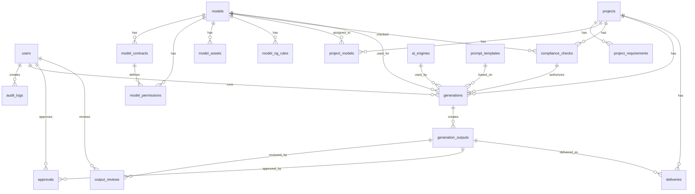

# 04 Database & ER Design

## 1. Mermaid ER Diagram

## 2. Core Tables

### users

| Column | Type | Notes |
|---|---|---|
| id | uuid | PK |
| name | varchar |  |
| email | varchar | unique |
| role | varchar | admin/legal/sales/creative/approver/viewer |
| department | varchar |  |
| status | varchar | active/suspended |
| last_login_at | timestamp |  |
| created_at | timestamp |  |
| updated_at | timestamp |  |

### models

| Column | Type | Notes |
|---|---|---|
| id | uuid | PK |
| stage_name | varchar | 芸名 |
| real_name | varchar | 本名 |
| agency_name | varchar | 所属事務所 |
| agency_contact_name | varchar |  |
| agency_contact_email | varchar |  |
| birth_date | date |  |
| adult_verified | boolean | 成人確認 |
| adult_verified_at | timestamp |  |
| status | varchar | available/suspended/expired |
| profile_image_path | text |  |
| notes | text |  |
| created_at | timestamp |  |
| updated_at | timestamp |  |

### model_contracts

| Column | Type | Notes |
|---|---|---|
| id | uuid | PK |
| model_id | uuid | FK models.id |
| contract_number | varchar |  |
| contract_type | varchar | base/individual/additional_consent |
| contract_start | date |  |
| contract_end | date |  |
| renewal_type | varchar | auto/negotiation/end |
| contract_file_path | text |  |
| consent_file_path | text |  |
| agency_approval_file_path | text |  |
| ai_generation_allowed | boolean |  |
| ai_training_allowed | boolean |  |
| synthetic_identity_allowed | boolean |  |
| post_contract_use_allowed | boolean |  |
| deletion_policy | text |  |
| created_by | uuid | FK users.id |
| created_at | timestamp |  |

### model_permissions

| Column | Type | Notes |
|---|---|---|
| id | uuid | PK |
| model_id | uuid | FK models.id |
| contract_id | uuid | FK model_contracts.id |
| media_scope | jsonb | web/sns/ec/print/outdoor/video |
| region_scope | jsonb | japan/asia/eu/global |
| product_scope | jsonb | allowed categories |
| prohibited_product_scope | jsonb | prohibited categories |
| swimwear_allowed | boolean |  |
| underwear_allowed | boolean |  |
| bath_allowed | varchar | yes/no/conditional |
| exposure_level_max | integer | 0-4 |
| face_edit_allowed | boolean |  |
| body_edit_allowed | boolean |  |
| hair_edit_allowed | boolean |  |
| makeup_edit_allowed | boolean |  |
| age_appearance_change_allowed | boolean |  |
| video_allowed | boolean |  |
| secondary_use_allowed | boolean |  |
| approval_required_level | varchar | internal/legal/agency/person |
| notes | text |  |
| created_at | timestamp |  |

### model_assets

| Column | Type | Notes |
|---|---|---|
| id | uuid | PK |
| model_id | uuid | FK models.id |
| asset_type | varchar | face/body/expression/pose/ng/reference |
| file_path | text |  |
| original_filename | varchar |  |
| file_hash | varchar |  |
| usage_type | varchar | training/reference/review_only/prohibited |
| consent_confirmed | boolean |  |
| photographer_right_confirmed | boolean |  |
| quality_score | integer |  |
| tags | jsonb |  |
| is_encrypted | boolean |  |
| uploaded_by | uuid | FK users.id |
| created_at | timestamp |  |

### projects

| Column | Type | Notes |
|---|---|---|
| id | uuid | PK |
| project_name | varchar |  |
| client_name | varchar |  |
| brand_name | varchar |  |
| product_name | varchar |  |
| product_category | varchar |  |
| owner_user_id | uuid | FK users.id |
| project_status | varchar | draft/generating/review/approved/delivered/closed |
| risk_level | varchar | low/middle/high/prohibited |
| deadline | date |  |
| created_at | timestamp |  |
| updated_at | timestamp |  |

### project_requirements

| Column | Type | Notes |
|---|---|---|
| id | uuid | PK |
| project_id | uuid | FK projects.id |
| media | jsonb |  |
| region | jsonb |  |
| usage_start | date |  |
| usage_end | date |  |
| output_type | varchar | image/video |
| scene_type | varchar | studio/resort/space/deepsea/bath/etc |
| outfit_type | varchar | normal/swimwear/underwear/etc |
| exposure_level | integer | 0-5 |
| pose_description | text |  |
| expression_description | text |  |
| background_description | text |  |
| reference_files | jsonb |  |
| client_notes | text |  |
| legal_notes | text |  |

### compliance_checks

| Column | Type | Notes |
|---|---|---|
| id | uuid | PK |
| project_id | uuid | FK projects.id |
| model_id | uuid | FK models.id |
| check_status | varchar | ok/conditional/ng/prohibited |
| risk_level | varchar | low/middle/high/prohibited |
| matched_permissions | jsonb |  |
| violations | jsonb |  |
| required_approvals | jsonb |  |
| check_summary | text |  |
| checked_by | uuid | FK users.id |
| checked_at | timestamp |  |

### generations

| Column | Type | Notes |
|---|---|---|
| id | uuid | PK |
| project_id | uuid | FK projects.id |
| model_id | uuid | FK models.id |
| compliance_check_id | uuid | FK compliance_checks.id |
| ai_engine_id | uuid | FK ai_engines.id |
| prompt_text | text |  |
| negative_prompt_text | text |  |
| prompt_template_id | uuid | FK prompt_templates.id |
| generation_params | jsonb |  |
| output_count | integer |  |
| status | varchar | queued/running/completed/failed |
| generated_by | uuid | FK users.id |
| generated_at | timestamp |  |

### generation_outputs

| Column | Type | Notes |
|---|---|---|
| id | uuid | PK |
| generation_id | uuid | FK generations.id |
| file_path | text |  |
| file_hash | varchar |  |
| thumbnail_path | text |  |
| width | integer |  |
| height | integer |  |
| output_status | varchar | candidate/selected/rejected/approved/delivered |
| visual_risk_score | integer |  |
| face_consistency_score | integer |  |
| quality_score | integer |  |
| watermark_applied | boolean |  |
| c2pa_metadata_applied | boolean |  |
| created_at | timestamp |  |

### approvals

| Column | Type | Notes |
|---|---|---|
| id | uuid | PK |
| output_id | uuid | FK generation_outputs.id |
| approver_id | uuid | FK users.id |
| approval_level | varchar | internal/legal/agency/person/admin |
| approval_status | varchar | approved/rejected/revoked |
| approval_comment | text |  |
| approved_at | timestamp |  |

### audit_logs

| Column | Type | Notes |
|---|---|---|
| id | uuid | PK |
| user_id | uuid | FK users.id |
| action_type | varchar | login/create/update/delete/generate/download/approve |
| target_type | varchar | model/project/output/contract |
| target_id | uuid |  |
| before_data | jsonb |  |
| after_data | jsonb |  |
| ip_address | varchar |  |
| user_agent | text |  |
| created_at | timestamp |  |

## 3. Critical DB Rules

1. `generations.compliance_check_id` is required.
2. Compliance check status must be `ok` or `conditional` before generation can run.
3. If status is `conditional`, required approvals must be configured before final delivery.
4. Contract and permission records must never be hard-deleted in ordinary operation.
5. Asset deletion should be soft-delete by default, with legal physical-delete procedure available.
6. Every create/update/delete/generate/download/approve action must write `audit_logs`.
